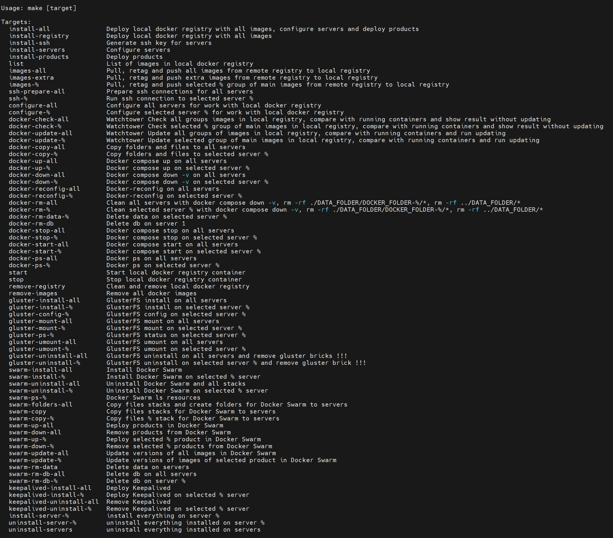

# Manual Docker and Docker Swarm Orchestrator

A multifunctional Makefile for preparing infrastructure, deploying and managing products in Docker and Docker Swarm. It simplifies the setup, configuration, and maintenance of a distributed environment with ease, incorporating Docker Swarm orchestration, SSH key management, GlusterFS integration, and Keepalived deployment across multiple servers.
Examples of Docker Compose and Docker Stack files are included.

---
- It is convenient for setting up a test environment for managing the deployment of products in Docker and Docker Swarm. 
- A local Docker repository can be useful when facing Docker Hub download limits. 
- A slightly trimmed and anonymized version, it might come in handy for someone.

---
### Key Features

- **Local Docker Registry Management:** Deploy and manage a local Docker registry, facilitating efficient image management.
- **SSH Management:** Generate SSH keys, prepare connections, and manage access across all servers.
- **Server Configuration:** Configure servers for seamless integration with the local Docker registry and deploy various products.
- **Docker Management:** Streamlined operations such as container lifecycle management (compose up/down), file copying, and cleanup tasks.
- **GlusterFS Management:** Install, configure, mount, unmount, and uninstall GlusterFS to support distributed file systems.
- **Docker Swarm Management:** Install, uninstall, deploy, and update Docker Swarm stacks across any number of servers.
- **Keepalived Management:** Deploy and remove Keepalived for high availability configurations.
- **And others.**

---
### Prerequisites

Fill in the variable values in the **settings.mk** file for each server you want to manage

```bash
SERVER_1_IP :=
SERVER_1_USER_LOGIN :=
SERVER_1_USER_PASSWORD :=
```

If using virtual IP, also set the value for KEEPALIVED_IP

```bash
KEEPALIVED_IP :=
```

Set REGISTRY_HOST_IP to the IP address of the server where the Makefile will run and deploy local docker registry

```bash
REGISTRY_HOST_IP :=
```

Follow the instructions in the header of the Makefile

---
### Usage

